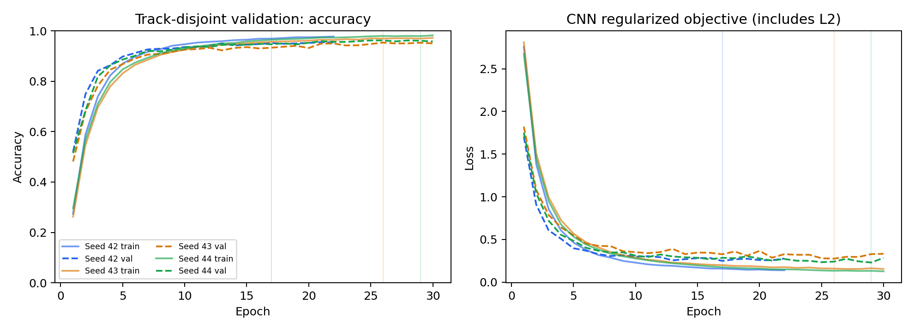

# TP Redes Neuronales: parte CNN

Clasificación de señales de tránsito de GTSRB con una CNN de Keras. El trabajo incluye una separación por señales físicas, tres entrenamientos con distintas semillas, una referencia lineal y la evaluación del modelo exportado. El informe ocupa tres páginas para dejar espacio a la parte RNN en el documento conjunto.

**Entregables:** [informe CNN](report/informe_cnn.pdf), [modelo entrenado](results/model.keras), [resultados completos](results/results.json) y [manifiesto de particiones](results/split_manifest.csv).

## Datos y separación

GTSRB tiene 43 clases. Cada *track* agrupa fotogramas de una misma señal física. El identificador combina clase y track, porque el número de track puede repetirse entre clases. Se reserva aproximadamente el 20 % de los tracks de cada clase para validación, con semilla 42. Ningún track se reparte entre entrenamiento y validación.

La revisión encontró ocho imágenes de desarrollo con los mismos píxeles RGB que imágenes del test oficial. Pertenecían al track `00014/00023`, de la clase Stop. Se excluyeron sus 30 fotogramas completos después de fijar la partición. La validación y el test conservaron todas sus imágenes.

| Partición | Imágenes | Tracks |
| --- | ---: | ---: |
| Entrenamiento | 31.350 | 1.045 |
| Validación | 7.829 | 261 |
| Excluidas por coincidencias con test | 30 | 1 |
| Test oficial | 12.630 | No identificados en los nombres públicos |

El control compara píxeles originales y preprocesados; no usa etiquetas ni desempeño del test para decidir qué excluir. El manifiesto conserva las 39.209 imágenes originales de desarrollo, incluidas las exclusiones con su motivo. El programa verifica que no haya grupos compartidos entre entrenamiento y validación ni coincidencias exactas entre las tres particiones usadas.

Hubo una evaluación anterior a esta limpieza. El entrenamiento corregido conserva arquitectura, hiperparámetros, semillas y validación. El cambio responde a duplicados encontrados en los datos, sin ajustar el modelo al resultado previo. En la ejecución corregida, el test se usa para el control de duplicados y, al terminar los entrenamientos de desarrollo, para evaluar la CNN principal.

## Modelo y procedimiento

Todas las imágenes se convierten a RGB y se redimensionan a 32 × 32 con interpolación bilineal. El modelo divide los píxeles por 255. Se usa la imagen completa suministrada por GTSRB, sin recortes adicionales ni aumentos de datos.

La CNN tiene tres bloques `Conv2D + MaxPooling2D`, con 16, 32 y 64 filtros de 3 × 3. Sigue una capa densa de 64 unidades, dropout de 0,3 y una salida softmax de 43 clases. Suma 91.979 parámetros entrenables. Usa ReLU e inicialización He en las capas ocultas, Adam con tasa 0,001, lotes de 128 imágenes y L2 de 0,0001 en los kernels convolucionales y de la capa densa oculta. `clipnorm=1` se conserva como precaución del diseño original; no se demostró que fuera necesario.

Cada corrida empieza con pesos nuevos y admite hasta 30 épocas. Early stopping observa la pérdida de validación, espera cinco épocas sin mejora y restaura los mejores pesos. Las semillas 42, 43 y 44 cambian la inicialización y el orden de entrenamiento sobre la misma partición. La semilla 42 está fijada como modelo principal; no se elige por su posición entre las tres. No se reentrena con las imágenes de validación.

La referencia lineal usa los mismos píxeles y particiones, con una única capa softmax de 132.139 parámetros. Esta comparación permite contrastar el ajuste de ambas familias de modelos. No aísla el efecto de la convolución, porque también cambian la profundidad, las activaciones y la regularización.

## Resultados

Resultados de la ejecución corregida, con las 30 imágenes excluidas y todos los controles de coincidencias en cero.

| Medida | Resultado |
| --- | ---: |
| Accuracy media de validación, tres semillas | 95,55 % |
| Desviación muestral entre semillas | 0,48 puntos porcentuales |
| Accuracy de entrenamiento, CNN principal | 99,88 % |
| Accuracy de validación, CNN principal | 95,18 % |
| Accuracy de validación, referencia lineal | 84,97 % |
| Accuracy de test, CNN principal | 92,61 % |
| F1 macro de test, CNN principal | 0,8969 |



Las curvas registran el entrenamiento con dropout activo y pesos que cambian durante cada época. Las métricas finales de entrenamiento se calculan con los pesos restaurados y dropout desactivado; por eso pueden diferir. La pérdida de las curvas incluye L2. La entropía cruzada informada en las tablas finales lo excluye.

F1 macro da el mismo peso a cada clase, mientras accuracy cuenta aciertos por imagen. La [matriz de confusión](results/test_confusion_matrix.png) usa colores normalizados por fila y muestra los conteos en las celdas. `results.json` también incluye precisión, recall, F1 y soporte por clase.

La CNN principal tiene un error de entrenamiento del 0,12 % y una brecha de 4,69 puntos porcentuales con validación. Ajusta los datos de entrenamiento, pero conserva errores ante otras señales: hay sobreajuste residual. La referencia lineal alcanza 94,27 % en entrenamiento y 84,97 % en validación; su brecha es mayor (9,30 puntos). No corresponde atribuir su menor resultado únicamente a sesgo alto. Dos corridas de la CNN alcanzaron el máximo de 30 épocas; ese límite impide asegurar que su pérdida ya no pudiera mejorar. La dispersión entre tres semillas mide sensibilidad a la inicialización y al orden de entrenamiento en esta partición. No es validación cruzada ni una estimación de variabilidad entre muestras; tampoco constituye una descomposición estadística de sesgo y varianza.

## Reproducir en Windows con Python 3.10

```powershell
py -3.10 -m venv .venv
.\.venv\Scripts\python.exe -m pip install -r requirements.txt
.\.venv\Scripts\python.exe -m pytest -q
.\.venv\Scripts\python.exe train.py --epochs 30 --threads 4 --output results_nuevo
.\.venv\Scripts\python.exe build_report.py --results results_nuevo --output report/informe_nuevo.pdf
.\.venv\Scripts\python.exe infer.py ruta\a\imagen.png --model results_nuevo/model.keras
```

Los archivos oficiales se descargan en `.cache/gtsrb`. El entrenamiento completo puede demorar en CPU. El ejemplo guarda una nueva ejecución para conservar los entregables incluidos. Para regenerar el informe incluido, ejecutar `build_report.py` sin argumentos.

`requirements-lock.txt` registra el entorno utilizado. Los resultados guardan versiones, configuración, hashes de los archivos descargados y del manifiesto. El hash SHA-256 del archivo de entrenamiento se calcula localmente: permite identificar la copia usada, pero no es una referencia de autenticidad publicada de manera independiente.

## Archivos y alcance

- `data.py`: descarga, preprocesamiento, separación por tracks y controles de duplicados.
- `cnn.py`: CNN y referencia lineal.
- `train.py`: entrenamientos, evaluación y gráficos.
- `infer.py`: clasificación de una imagen con el modelo exportado.
- `test_cnn.py`: pruebas de particiones, exclusiones, preprocesamiento y guardado/carga.
- `build_report.py`: informe de tres páginas generado a partir de los resultados corregidos.

Las pruebas usan datos sintéticos; no descargan GTSRB ni entrenan el experimento completo. El modelo clasifica imágenes de señales ya recortadas: no localiza señales en fotografías completas. La evaluación corresponde a GTSRB y no garantiza el mismo desempeño con señales de otros países, cámaras o condiciones. La separación por tracks y la limpieza de duplicados reducen fugas concretas; no prueban que el dataset esté libre de todo atajo visual.

## Fuentes

- [GTSRB: artículo original de Stallkamp y colaboradores](https://christian-igel.github.io/paper/MvCBMLAfTSR.pdf)
- [Archivos oficiales de GTSRB](https://sid.erda.dk/public/archives/daaeac0d7ce1152aea9b61d9f1e19370/published-archive.html)
- [Conv2D en Keras](https://keras.io/api/layers/convolution_layers/convolution2d/)
- [MaxPooling2D en Keras](https://keras.io/api/layers/pooling_layers/max_pooling2d/)
