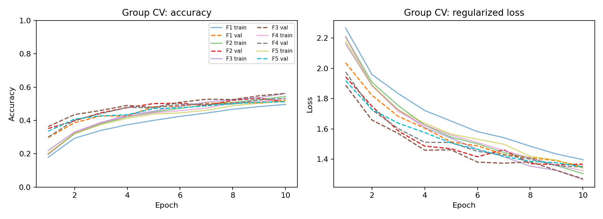

# TP Redes Neuronales — Parte 1: CNN

Clasificación de imágenes de CIFAR-10 con una red convolucional de Keras. Incluye entrenamiento reproducible, validación cruzada por lotes, diagnóstico empírico de sesgo/varianza, evaluación final, pesos exportados y un informe en español.

**Entregables:** [informe técnico de cinco páginas](report/informe_cnn.pdf), [modelo entrenado](results/model.keras) y [resultados completos](results/results.json). Los scripts están escritos en inglés y el informe en español. Este repositorio resuelve únicamente el módulo CNN.

## Resultados de la ejecución incluida

Entrenamiento real en CPU: 10.000 imágenes de desarrollo, cinco folds por lote y 10.000 imágenes de prueba independientes. No se detectaron duplicados exactos. El modelo final se entrenó durante diez épocas fijadas mediante validación.

| Medida | Resultado |
| --- | ---: |
| Accuracy media de validación | 53,22 % |
| Desviación entre folds | 1,88 puntos porcentuales |
| Accuracy de entrenamiento del modelo final | 59,91 % |
| Accuracy de prueba | **53,42 %** |
| F1 macro de prueba | **0,5218** |
| Accuracy con desplazamiento de 2 píxeles | 39,62 % |
| Diferencia de probabilidades al recargar el modelo | 0 |

En el mismo holdout, la CNN alcanzó 52,15 % frente a 33,65 % del modelo lineal y 47,75 % de la CNN con la mitad de datos. El desempeño muestra aprendizaje, pero también errores importantes y sensibilidad a desplazamientos. Cuatro de cinco folds encontraron su mejor época en el límite del presupuesto: no se afirma haber alcanzado convergencia ni descartado todos los atajos visuales.



## Ejecutar en Windows (Python 3.10)

```powershell
py -3.10 -m venv .venv
.\.venv\Scripts\python.exe -m pip install -r requirements.txt
.\.venv\Scripts\python.exe -m pytest -q
.\.venv\Scripts\python.exe train.py --epochs 10 --samples-per-batch 2000 --threads 4
.\.venv\Scripts\python.exe build_report.py
.\.venv\Scripts\python.exe infer.py ruta\a\imagen.png --model results/model.keras
```

El entrenamiento descarga CIFAR-10 en `.cache/keras` (no se versiona). La configuración predeterminada selecciona 2.000 imágenes por cada uno de los cinco lotes originales: **10.000 imágenes de desarrollo**, no las 50.000 originales. `--samples-per-batch 0` usa todo el conjunto de desarrollo después de eliminar duplicados exactos. El test conserva todas las imágenes que superan la depuración. Cada nueva ejecución reemplaza `results/`; usar `--output results_otro` para preservar resultados anteriores. El entrenamiento completo puede demorar considerablemente en CPU.

## Arquitectura y protocolo

Entrada RGB 32×32, reescalado interno de 0–255 a 0–1; tres bloques Conv2D de 16/32/64 filtros 3×3, stride 1, padding `same`, ReLU y MaxPooling2D 2×2 con stride 2. Luego Flatten, Dense(64), dropout 0,3 y softmax de 10 clases. Inicialización He, regularización L2 de 0,0001, Adam 0,001 con `clipnorm=1`. La salida de cada bloque tiene forma 16×16×16, 8×8×32 y 4×4×64. No hay aumentación aleatoria ni normalización estimada del test.

1. Se eliminan imágenes exactamente iguales por SHA256 de píxeles originales antes de muestrear. Se conserva la primera aparición; desarrollo tiene prioridad sobre test. Las etiquetas no intervienen.
2. El muestreo estratificado y determinista se hace dentro de cada lote de desarrollo. `GroupKFold(5)` deja un lote completo para validación por pliegue. Cada muestra obtiene una sola predicción fuera de su entrenamiento (OOF).
3. Cada pliegue entrena desde cero, con early stopping por pérdida de validación, paciencia 3 y restauración del mejor estado. Las métricas de entrenamiento se vuelven a calcular en inferencia, sin dropout, para comparar con validación.
4. Dos diagnósticos usan exclusivamente el holdout del primer pliegue: regresión softmax sobre píxeles reducidos y la CNN con la mitad del entrenamiento. Permiten examinar capacidad y cantidad de datos sin consultar test.
5. La mediana de las mejores épocas de los cinco pliegues fija la duración del ajuste final sobre todo desarrollo. El test original depurado se evalúa después de fijar estas decisiones. Se realiza además una prueba de robustez predefinida: traslación de 2 píxeles hacia abajo y derecha, con relleno negro.

La selección del mejor estado monitoriza pérdida que incluye L2; `cross_entropy` en los JSON es solamente la entropía cruzada de las probabilidades, sin regularización. Las curvas de entrenamiento durante el ajuste incluyen dropout; el análisis de brechas usa las métricas recalculadas en inferencia. Desvío entre pliegues se calcula con `ddof=1`; no representa un intervalo de confianza.

**Límites:** los lotes originales son particiones del dataset, no grupos verificados de cámaras, pacientes o escenas. Evitar mezclar lotes permite cumplir una validación por lotes, pero no demuestra generalización a fuentes nuevas. El hash detecta duplicados exactos, no imágenes visualmente parecidas. Un conjunto pequeño y pocas épocas limitan la precisión; los diagnósticos de sesgo y varianza son indicios empíricos, no una descomposición estadística formal. La robustez ante un desplazamiento no demuestra invariancia general. No se ajustan hiperparámetros a partir del test.

## Archivos

- `cnn.py`: preparación de datos, particiones y arquitectura.
- `train.py`: entrenamiento y generación de resultados reales.
- `infer.py`: inferencia sobre una imagen RGB redimensionada a 32×32. La salida incluye probabilidades; no se garantiza calibración ni desempeño fuera de CIFAR-10.
- `test_cnn.py`: pruebas de duplicados, particiones, selección determinista y equivalencia al recargar.
- `results/model.keras`: modelo completo entrenado, con pesos y reescalado interno.
- `results/results.json`: métricas, curvas, diagnósticos, versiones y configuración.
- `results/data_manifest.json`: conteos, grupos, índices seleccionados y hashes para auditoría.
- `results/predictions.npz`: etiquetas y probabilidades OOF, test y test desplazado.
- `results/*png`: curvas, matriz de confusión y primeras 18 predicciones del test (sin seleccionar por acierto).

Las semillas y operaciones deterministas facilitan reproducir resultados en el mismo entorno. Diferencias de hardware y versiones pueden producir pequeñas variaciones. Las pruebas no descargan el dataset ni ejecutan entrenamiento completo. `requirements-lock.txt` registra todas las versiones del entorno Windows/Python 3.10 utilizado; se puede instalar con `pip install -r requirements-lock.txt` para fijar también las dependencias indirectas.

`build_report.py` reconstruye el PDF desde los JSON y gráficos de la ejecución y verifica el límite de cinco páginas. Si se usa otro directorio de resultados: `python build_report.py --results results_otro --output report/informe_otro.pdf`. Conviene revisar visualmente el informe después de cada nueva ejecución.

## Fuentes

- [CIFAR-10, Alex Krizhevsky — descripción y descarga oficial](https://www.cs.toronto.edu/~kriz/cifar.html).
- [Keras CIFAR-10](https://keras.io/api/datasets/cifar10/).
- [Keras Conv2D](https://keras.io/api/layers/convolution_layers/convolution2d/).
- [GroupKFold, scikit-learn](https://scikit-learn.org/stable/modules/generated/sklearn.model_selection.GroupKFold.html).

No se distribuye el dataset en este repositorio. Las métricas del trabajo provienen de la ejecución guardada; cambiar la configuración exige volver a generar y revisar el informe.
